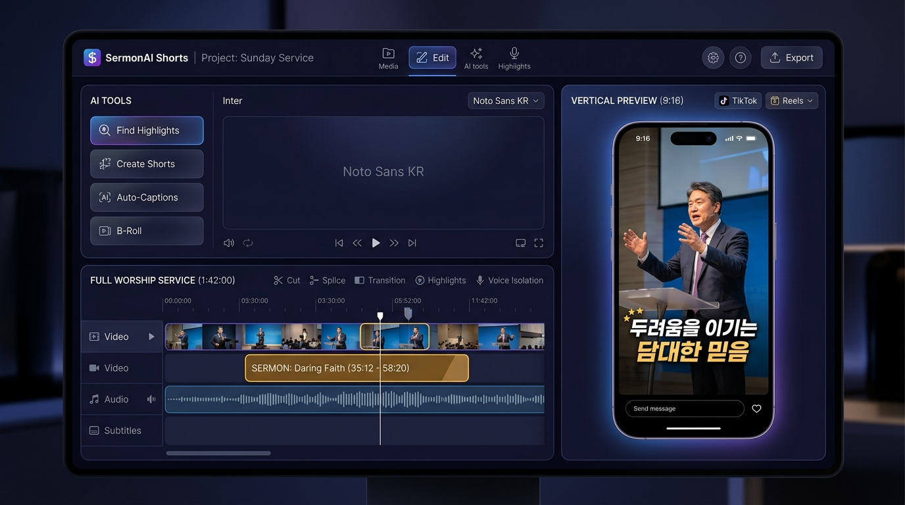

# 🌟 GraceClip AI (설교 AI 쇼츠 메이커)

> **예배 영상 하나로, 한 주 사역 자료 & 1분 은혜 쇼츠 자동 완성!**



## 📌 프로젝트 소개
**GraceClip AI**는 1~2시간 예배 풀영상에서 AI가 목사님의 설교 구간만 99.8% 감지하여, 1분 컷 세로형 쇼츠(YouTube Shorts / Instagram Reels / TikTok)와 카드뉴스, 소그룹 나눔지, QT 5일치, PPT 템플릿을 단 3분 만에 자동 생성해주는 미디어 사역 웹 플랫폼입니다.

## ✨ 주요 기능
1. **🎬 예배 풀영상 오토 스캐닝 & 설교 구간 자동 탐지** (찬양/광고 자동 스킵)
2. **📱 9:16 세로 쇼츠 라이브 편집기** (네온, 모던, 클래식, 박스 자막 스타일 & 오디오 이퀄라이저)
3. **🖼️ 카드뉴스 5종 패키지** (인스타그램/카카오톡 1:1 규격 이미지)
4. **👥 소그룹 나눔지 & QT 5일치** (순모임/구역예배 교안 및 주간 성도 묵상집)
5. **💻 설교 요약 PPT & 숏폼 대본** (16:9 슬라이드 템플릿 & 스크립트)
6. **⚡ 6가지 사역 생성기** (가정예배지, 음성 팟캐스트, 소그룹 리더가이드, 말씀카드 이미지 등)

## 🛠️ 기술 스택
- **Frontend**: HTML5, CSS3 (Glassmorphism, Responsive Grid, Flexbox), Vanilla JavaScript (ES6+)
- **Design System**: Inter, Outfit, Noto Sans KR, FontAwesome Icons

## 🚀 실행 방법
이 프로젝트는 별도의 빌드 과정 없이 웹 브라우저에서 바로 동작합니다.

```bash
# 로컬 개발 서버 실행 (Python 예시)
python3 -m http.server 8085
```
웹 브라우저에서 `http://localhost:8085`로 접속하면 라이브 인터랙티브 스튜디오를 이용할 수 있습니다.
